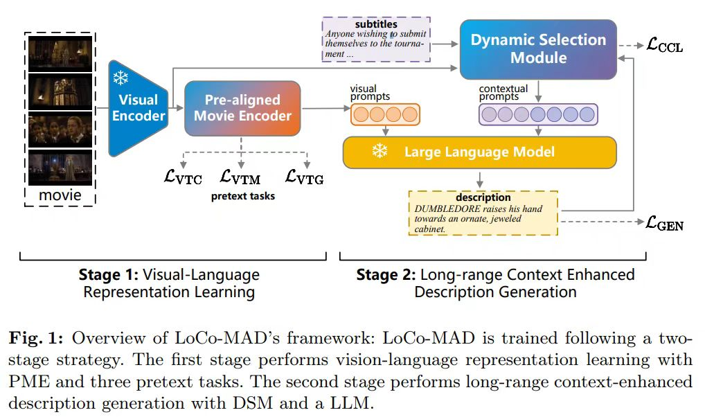
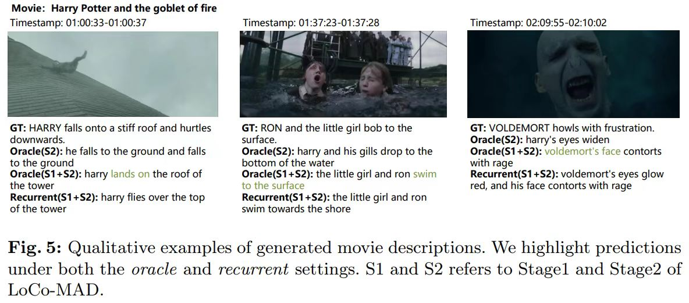

# LoCo-MAD: Long-Range Context-Enhanced Model Towards Plot-Centric Movie Audio Description

## Details



## Results


## Datasets

**MAD-v2**: please refer to [AutoAD](https://www.robots.ox.ac.uk/~vgg/research/autoad/v1.html). The size of propressed dataset is over 50G. Please e-mail me to obtain it.

## Referenc

```text
@InProceedings{wang2024loco-mad,
  title={LoCo-MAD: Long-Range Context-Enhanced Model Towards Plot-Centric Movie Audio Description},  
  author={Jiayi Wang and Zihao Liu and Xiaoyu Wu},  
  booktitle={ACCV},  
  year={2024}}
```